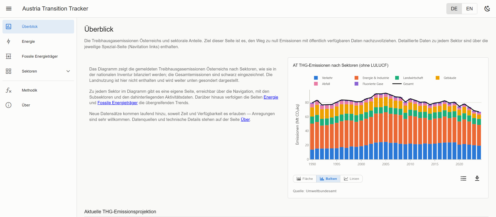

# Austria Transition Tracker

A dashboard of Austria's energy transition and greenhouse gas emissions, built from public
data. It covers emissions by sector, energy supply and consumption, fossil fuel use, and
the transport, buildings, industry, agriculture, waste, F-gas and land-use sectors —
89 charts across twelve routes, in German and English.



**Live demo:** [bethadata.github.io/austria-transition-tracker-v2](https://bethadata.github.io/austria-transition-tracker-v2/)

---

## Features

- **Twelve routes** — an overview, energy, fossil fuels, seven sector pages, a methodology page and an about page
- **Six chart shapes** — line, stacked area, area with a negative side (the LULUCF sink), stacked bar, a reader-switchable area / bar / line toggle, and a dataset selector
- **Emissions projection** — official Austrian emissions are published about eighteen months late, so the missing years are projected from monthly fossil fuel consumption. Everything derived that way is labelled as a projection and carries an uncertainty band; the method is typeset on the Methodology page
- **Bilingual** — German and English
- **Static deployment** — every chart renders in the browser from a JSON contract; no server and no API keys

---

## Tech Stack

| Category | Library / Tool | Version |
|---|---|---|
| Framework | [Vue 3](https://vuejs.org/) | 3.5 |
| Language | TypeScript | ~5.9 |
| Build tool | [Vite](https://vitejs.dev/) | 8 |
| UI components | [Vuetify](https://vuetifyjs.com/) | 4 |
| Charts | [Plotly.js](https://plotly.com/javascript/) (basic bundle) | 3.7 |
| Formulas | [KaTeX](https://katex.org/) | 0.16 |
| State | [Pinia](https://pinia.vuejs.org/) | 4 |
| Routing | Vue Router (hash mode) | 5 |
| i18n | Vue I18n | 11 |
| Data pipeline | Python + pandas, Poetry-managed | 3.11+ |

---

## Structure

Two halves, in one repository:

- **`services/`** — a Python pipeline that downloads the source data, models what has to be
  modelled, and writes a data contract into `public/data/`. It draws nothing.
- **the app at the repository root** — the Vue frontend that renders every chart from that
  contract.

The two meet at `public/data/manifest.json`: **the pipeline emits ids and
numbers, the frontend owns every visible string.** Titles, units, series labels, source
names and notes all live in `src/locales/{de,en}/`, keyed by chart id.

```
services/
  paths.py            every path the pipeline uses, derived from this file's location
  series.py           the series algebra both halves of the pipeline speak
  pipeline.py         the orchestrator — the one list of chart modules
  scrape.py           the two automatable downloads
  check_contract.py   validates manifest, data and locales against each other
  publish.py          commit + push public/data, main only, named paths only
  scheduler.py        optional local nightly scheduler
  sources/            one module per data provider
  models/             what the project computes rather than reports
  charts/             the call sites: one module per page or topic
  download/           the scrapers
  figures/            the three methodology diagrams (matplotlib, run by hand)
  data_raw/           source data; see data_raw/MANUAL_DOWNLOADS.md

public/data/          manifest.json + <chart-id>.json — the contract
src/                  the Vue app; src/locales/{de,en}/ own every visible string
tools/smoke.mjs       headless browser test, 12 routes x 2 locales
```

---

## Getting Started

### Frontend

Requires Node 22 or newer.

```bash
npm install
npm run dev        # development server on :5173
npm run build      # type-check and build into dist/
npm run preview    # serve the real build on :4175
npm run typecheck
npm run test:smoke # headless browser test over all routes and both locales
```

### Data pipeline

Dependencies are declared in **`services/pyproject.toml`**; setup is via
[Poetry](https://python-poetry.org/). Python 3.11 or newer.

> No configuration step is needed. **`services/paths.py`** holds every path the pipeline
> uses and derives them all from that file's own location, so they resolve to the
> repository root.

From `services/`:

```bash
poetry install

poetry run python scrape.py           # download eurostat and E-Control data
poetry run python pipeline.py         # rebuild every chart from the raw data
poetry run python check_contract.py   # validate the output against the frontend contract

poetry run python -m download.energy_balance   # the eurostat energy balance, annually
poetry run python -m figures.methodology       # regenerate the methodology figures
```

The first three are also reachable from the repository root as `npm run data:scrape`,
`npm run data` and `npm run data:check`.

`check_contract.py` is worth running after every pipeline run: the failures it catches — a
chart with no data file, a series named in the manifest but absent from the data, a missing
locale key — all render as a blank or silently wrong chart rather than as an error.

---

## Data sources

Two sources are automated. Everything else is a manual download; the refresh instructions for each live in
`services/data_raw/MANUAL_DOWNLOADS.md`.

| Source | How | Cadence |
|---|---|---|
| eurostat monthly/yearly tables | `scrape.py` | daily |
| E-Control MoMeGes electricity | `scrape.py` | daily |
| eurostat full energy balance | `python -m download.energy_balance` | ~annual, by hand |
| Statistik Austria vehicle registrations and stock | drop into `data_raw/statistik_austria/Fahrzeuge/` | monthly, by hand |
| Statistik Austria Mikrozensus (heating, air conditioners) | `data_raw/statistik_austria/` | biennial, by hand |
| StatCube meat and milk consumption | `data_raw/statistik_austria/` | annual, by hand |
| UBA Klimadashboard (the anchor emissions figure) | `data_raw/umweltbundesamt/` | annual, by hand |
| EEA / UNFCCC inventory | `data_raw/eea/` | annual, by hand |
| National Inventory Report land-use tables | `data_raw/national_inventory_report/` | annual, by hand |

Which file is live is always decided by the filename — the newest dated export wins — and
which years exist is read off the directory. Neither is ever a literal in Python, so
refreshing data never means editing code.

---

## Publishing

**`services/publish.py`** commits and pushes the pipeline's own output. It publishes only
from `main` and stages only the paths it produced, so a run from the wrong checkout refuses
rather than committing whatever happens to be in the tree.

**`services/scheduler.py`** can drive the whole process — download, rebuild, publish — on a
nightly schedule, using a FastAPI-based background scheduler. It has to stay running on one
machine; most of the sources are manual drops, so the dashboard is refreshed by hand in
practice.

> For GitHub Pages publishing, a corresponding remote has to be set in your local
> repository.

---

## Related projects

Two sibling dashboards, same stack and same conventions:

- [Austria Population Tracker](https://bethadata.github.io/austria-population-tracker/) — population by region, 2002 to today
- [Austria Power Simulator](https://bethadata.github.io/austria-power-sim/) — hourly electricity balance

---

## Licence

MIT for the code — see [LICENSE](LICENSE). Charts and data are published under CC BY 4.0;
the underlying data belongs to the sources named on each chart.
